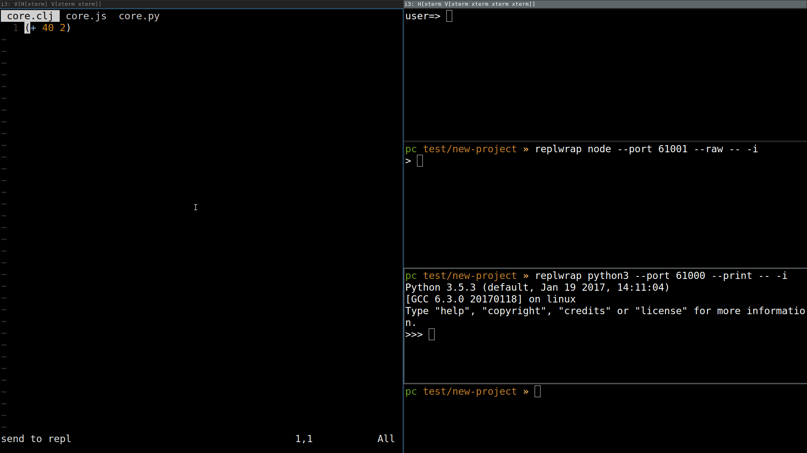

# replwrap

with `replwrap` you can wrap your repl in a websocket and send input from anywhere



## installation
```
npm i -g replwrap
```
to send input from vim add this to your `~/.vimrc` (using vim-plug)
```
Plug 'raoofha/replwrap'
```
## features
* print and evaluate input received from ```--host localhost --port 60999``` 

## vim plugin features
* use space to send current line, form or selection to repl
* change server port depending on file type
  - .clj, .cljc, .cljs `60999`
  - .py `61000`
  - .js `61001`


## usage
```
replwrap program [--port 60999 --host localhost --print --raw] -- [args...]
```

clojure
```
replwrap rlwrap -- lein repl
```

python 
```
replwrap python3 --port 61000 --print -- -i
```

node
```
replwrap node --port 61001 --raw -- -i
```

for convenience you can put these line in your `~/.zshrc` or whatever
```
alias wlumo="replwrap lumo"
alias wclojure="replwrap rlwrap -- lein repl"
alias arcadia="replwrap node --raw -- ~/git/Arcadia/Editor/repl-client.javascript"
alias wpython3="replwrap python3 --port 61000 --print -- -i"
alias wnode="replwrap node --port 61001 --raw -- -i"
```

## similar software
* [vim-slime](https://github.com/jpalardy/vim-slime) depenend on tmux/screen/... so if you want to use tmux or screen I think it must be fine I didn't test it myself

## extra
if you want vi binding in your repl put these in your `~/.inputrc`. it doesn't work for lumo and node
```
set editing-mode vi
set keymap vi-insert
# these are for vi-insert mode
Control-l: clear-screen 
```
